# 🚨 SOC Blackout

**AI-Powered Incident Commander — Built with Elastic Agent Builder**

SOC Blackout is a multi-step AI agent that automates production incident response. It detects anomalies in infrastructure metrics, diagnoses error patterns in application logs, correlates findings with a historical knowledge base of past incidents, and coordinates remediation — all with human-in-the-loop safety.

> **Average manual MTTR**: ~45 minutes → **SOC Blackout**: < 2 minutes

---

## 🏗️ Architecture

```mermaid
flowchart TD
    O["👤 Operator<br/>(Kibana Chat / MCP)"] --> A["🚨 SOC Blackout Agent"]
    
    A --> T1["anomaly_detector<br/>ES|QL Tool"]
    A --> T2["log_analyzer<br/>ES|QL Tool"]
    A --> T3["incident_search<br/>Index Search Tool"]
    A --> T4["remediation_workflow<br/>Workflow Tool"]
    
    T1 --> M[("soc-metrics")]
    T2 --> L[("soc-logs")]
    T3 --> I[("soc-incidents")]
    T4 --> AC[("soc-actions")]
    
    A --> S["🛡️ Safety: Confidence Score + Human Approval + Kill Switch"]
```



For a detailed architecture with data flow diagrams, see [docs/architecture.md](docs/architecture.md).

---

## ✨ Features

| Feature | Description |
|---|---|
| **6-Phase Workflow** | Detect → Diagnose → Correlate → Assess → Propose → Execute |
| **4 Custom Tools** | 2 ES\|QL (metrics + logs), 1 Index Search (incident KB), 1 Workflow (remediation) |
| **Historical Correlation** | RAG search over 8 past incidents to find pattern matches |
| **Confidence Scoring** | 0-100 score with threshold-based behavior (< 70% = analysis-only mode) |
| **Human-in-the-Loop** | Agent never auto-executes — requires explicit operator approval |
| **Kill Switch** | Operator can say "ABORT" at any time to halt all actions |
| **Audit Trail** | Every action logged to `soc-actions` index with confidence + status |
| **MCP Server** | Agent accessible via Claude Desktop, Cursor, VS Code, or custom CLI |

---

## 🚀 Quick Start

### Prerequisites

- Python 3.10+
- An [Elasticsearch Serverless](https://cloud.elastic.co/registration?cta=agentbuilderhackathon) account (free trial)
- Agent Builder enabled in your Elasticsearch deployment

### 1. Clone & Configure

```bash
git clone https://github.com/YOUR_USERNAME/soc-blackout.git
cd soc-blackout
cp .env.example .env
# Edit .env with your Elasticsearch URL and API key
```

### 2. Run Setup

```bash
chmod +x scripts/setup.sh
./scripts/setup.sh
```

This will:
- Install Python dependencies
- Create 4 Elasticsearch indices (`soc-logs`, `soc-metrics`, `soc-incidents`, `soc-actions`)
- Seed synthetic data with demo scenarios

### 3. Create Custom Tools in Agent Builder

Before creating the agent, we must create its tools.
1. Open **Kibana → Agent Builder → Tools**
2. Click **Create Tool**, then create these 4 tools using the configurations in the `tools/` directory:
   - `anomaly_detector` (ES|QL tool) — copy prompt & query from [`tools/anomaly_detector.esql`](tools/anomaly_detector.esql)
   - `log_analyzer` (ES|QL tool) — copy prompt & query from [`tools/log_analyzer.esql`](tools/log_analyzer.esql)
   - `incident_search` (Index Search tool) — copy configuration from [`tools/incident_search.json`](tools/incident_search.json)
   - `remediation_workflow` (Workflow tool) — you'll need to create the workflow first using [`tools/remediation_workflow.yml`](tools/remediation_workflow.yml), then select it here.

### 4. Create the Agent

1. Open **Kibana → Agent Builder → Agents → New Agent**
2. **Agent ID**: `soc-blackout`
3. **Display Name**: SOC Blackout
4. **Custom Instructions**: Copy contents of [`agent/instructions.md`](agent/instructions.md)
5. **Assign Tools**: Select the 4 tools you just created (`anomaly_detector`, `log_analyzer`, `incident_search`, `remediation_workflow`)
6. **Save and Chat**

### 4. Try It

In the Agent Builder Chat, type:

> *"We're getting memory alerts on production. What's happening?"*

Watch SOC Blackout run through its 6-phase workflow automatically.

---

## 🎭 Demo Scenarios

Three pre-built scenarios are available in `demo/scenarios/`:

| Scenario | What Happens | Expected Correlation |
|---|---|---|
| `cpu_spike` | API Gateway CPU at 100% (recursive middleware) | Matches INC-002 |
| `oom_crash` | Payment service OOM-killed (connection pool leak) | Matches INC-001 |
| `cascading_failure` | Auth service failure cascades to all services | Matches INC-003 |

Seed a specific scenario:
```bash
python3 scripts/seed_data.py  # Choose scenario 1, 2, or 3
```

---

## 🔌 MCP Integration

Connect SOC Blackout to your IDE or CLI via the MCP protocol:

```json
{
  "mcpServers": {
    "soc-blackout": {
      "command": "npx",
      "args": ["mcp-remote", "${KIBANA_URL}/api/agent_builder/mcp", "--header", "Authorization:${AUTH_HEADER}"],
      "env": {
        "KIBANA_URL": "your-kibana-url",
        "AUTH_HEADER": "ApiKey your-api-key"
      }
    }
  }
}
```

See [`mcp/mcp_config.json`](mcp/mcp_config.json) for the full configuration.

---

## 📁 Project Structure

```
soc-blackout/
├── README.md                    # This file
├── LICENSE                      # MIT License
├── .env.example                 # Environment variables template
├── docs/
│   ├── architecture.md          # Architecture diagrams (Mermaid)
│   └── demo-script.md           # Demo video script
├── agent/
│   ├── instructions.md          # Custom agent prompt (6-phase workflow)
│   └── config.json              # Agent configuration reference
├── tools/
│   ├── anomaly_detector.esql    # ES|QL — Infrastructure anomaly detection
│   ├── log_analyzer.esql        # ES|QL — Error pattern analysis
│   ├── incident_search.json     # Index Search — Historical incident RAG
│   └── remediation_workflow.yml # Workflow — Safe remediation execution
├── mcp/
│   └── mcp_config.json          # MCP server client configuration
├── scripts/
│   ├── seed_data.py             # Synthetic data generator (4 indices)
│   ├── setup.sh                 # One-command setup
│   └── requirements.txt         # Python dependencies
└── demo/
    └── scenarios/               # Pre-built demo scenarios
        ├── cpu_spike.json
        ├── oom_crash.json
        └── cascading_failure.json
```

---

## 🛡️ Safety Design

SOC Blackout is designed with production safety as a first-class concern:

1. **2-Phase Execution**: The agent always proposes before executing. No silent actions.
2. **Confidence Threshold**: If confidence < 70%, the agent enters analysis-only mode and recommends human investigation.
3. **Kill Switch**: The operator can say "ABORT" at any time to halt all operations.
4. **Full Audit Trail**: Every action (proposed, approved, executed, rejected) is logged to `soc-actions` with timestamps and confidence scores.
5. **Scoped Permissions**: MCP API keys are restricted to `soc-*` indices with read-only access.

---

## 🏆 Agent Builder Features Used

| Feature | How We Use It |
|---|---|
| **Custom Agent** | Tailored instructions with 6-phase incident response workflow |
| **ES\|QL Tools** | 2 parameterized queries for real-time metrics and log analysis |
| **Index Search Tool** | Semantic search over historical incident knowledge base |
| **Workflow Tool** | Automated remediation with audit logging + post-mortem generation |
| **MCP Server** | Agent accessible from Claude Desktop, Cursor, VS Code, or Slack |
| **Kibana Chat** | Primary interface for operator interaction |

---

## 💡 What We Liked

1. **ES|QL Power**: The ability to write complex aggregation queries with JOINs and pipe them directly as agent tools is incredibly powerful. It makes the agent feel like it truly "understands" the data.
2. **Workflow Integration**: The `ai.agent` step in Workflows creates a feedback loop where agents can reason about the results of their own actions — perfect for post-mortem generation.
3. **MCP Server**: Being able to expose the same agent to multiple interfaces (Kibana, CLI, IDE) without any additional code is a game-changer for adoption.

## ⚡ Challenges

1. **Prompt Engineering for Safety**: Getting the agent to consistently follow the 6-phase workflow AND respect the confidence threshold required extensive iteration on the system prompt.
2. **Synthetic Data Realism**: Creating synthetic logs and metrics that produce compelling and believable demo scenarios required careful tuning of error patterns and timing.

---

## 📄 License

MIT — See [LICENSE](LICENSE)

---

*Built for the [Elasticsearch Agent Builder Hackathon](https://elasticsearch.devpost.com)*
