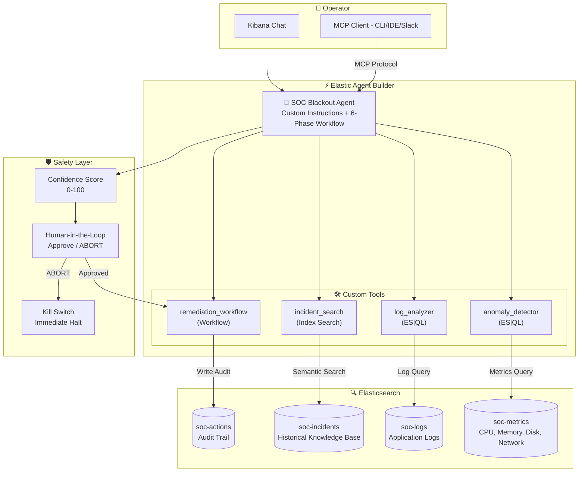
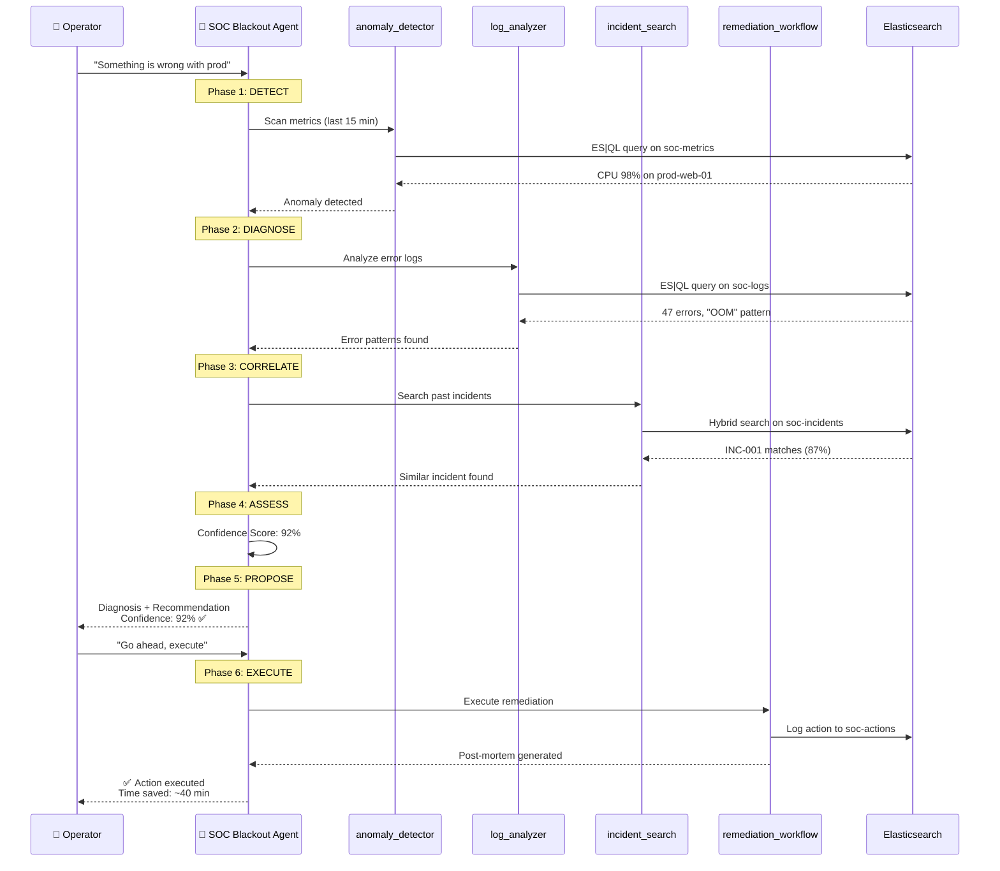

# SOC Blackout — Architecture

## System Architecture

## Data Flow

## Index Schema

| Index | Purpose | Key Fields | Query Method |
|---|---|---|---|
| `soc-metrics` | Infrastructure metrics | `@timestamp`, `host`, `cpu_pct`, `mem_pct`, `disk_io` | ES\|QL |
| `soc-logs` | Application logs | `@timestamp`, `service`, `level`, `message`, `host` | ES\|QL |
| `soc-incidents` | Historical KB | `incident_id`, `title`, `root_cause`, `runbook` | Index Search (semantic) |
| `soc-actions` | Audit trail | `@timestamp`, `action_type`, `confidence`, `status` | Written by Workflow |
