# SOC Blackout — Architecture

## System Architecture

```mermaid
flowchart TD
    subgraph User["👤 Operator"]
        KC[Kibana Chat]
        MCP_C[MCP Client - CLI/IDE/Slack]
    end

    subgraph AgentBuilder["⚡ Elastic Agent Builder"]
        AGENT["🚨 SOC Blackout Agent<br/>Custom Instructions + 6-Phase Workflow"]

        subgraph Tools["🛠️ Custom Tools"]
            T1["anomaly_detector<br/>(ES|QL)"]
            T2["log_analyzer<br/>(ES|QL)"]
            T3["incident_search<br/>(Index Search)"]
        end
    end

    subgraph Elasticsearch["🔍 Elasticsearch"]
        I1[("soc-metrics<br/>CPU, Memory, Disk, Network")]
        I2[("soc-logs<br/>Application Logs")]
        I3[("soc-incidents<br/>Historical Knowledge Base")]
    end

    subgraph Safety["🛡️ Safety Layer"]
        CS["Confidence Score<br/>0-100"]
        HIL["Human-in-the-Loop<br/>Approve / ABORT"]
        KS["Kill Switch<br/>Immediate Halt"]
    end

    KC --> AGENT
    MCP_C -->|MCP Protocol| AGENT

    AGENT --> T1
    AGENT --> T2
    AGENT --> T3

    T1 -->|Metrics Query| I1
    T2 -->|Log Query| I2
    T3 -->|Semantic Search| I3

    AGENT --> CS
    CS --> HIL
    HIL -->|ABORT| KS
```

## Data Flow

```mermaid
sequenceDiagram
    participant O as 👤 Operator
    participant A as 🚨 SOC Blackout Agent
    participant AD as anomaly_detector
    participant LA as log_analyzer
    participant IS as incident_search

    O->>A: "Something is wrong with prod"
    Note over A: Phase 1: DETECT
    A->>AD: Scan metrics (last 15 min)
    AD->>A: CPU 98% on prod-web-01

    Note over A: Phase 2: DIAGNOSE
    A->>LA: Analyze error logs
    LA->>A: 47 errors, "OOM" pattern

    Note over A: Phase 3: CORRELATE
    A->>IS: Search past incidents
    IS->>A: INC-001 matches (87%)

    Note over A: Phase 4: ASSESS
    A->>A: Confidence Score: 92%

    Note over A: Phase 5: PROPOSE
    A-->>O: Diagnosis + Recommendation<br/>Confidence: 92% ✅

    O->>A: "Go ahead"

    Note over A: Phase 6: REPORT
    A-->>O: ✅ Post-mortem generated<br/>Root cause + Actions + Prevention<br/>Time saved: ~40 min
```

## Index Schema

| Index | Purpose | Key Fields | Query Method |
|---|---|---|---|
| `soc-metrics` | Infrastructure metrics | `@timestamp`, `host`, `cpu_pct`, `mem_pct`, `disk_io` | ES\|QL |
| `soc-logs` | Application logs | `@timestamp`, `service`, `level`, `message`, `host` | ES\|QL |
| `soc-incidents` | Historical KB | `incident_id`, `title`, `root_cause`, `runbook` | Index Search (semantic) |
